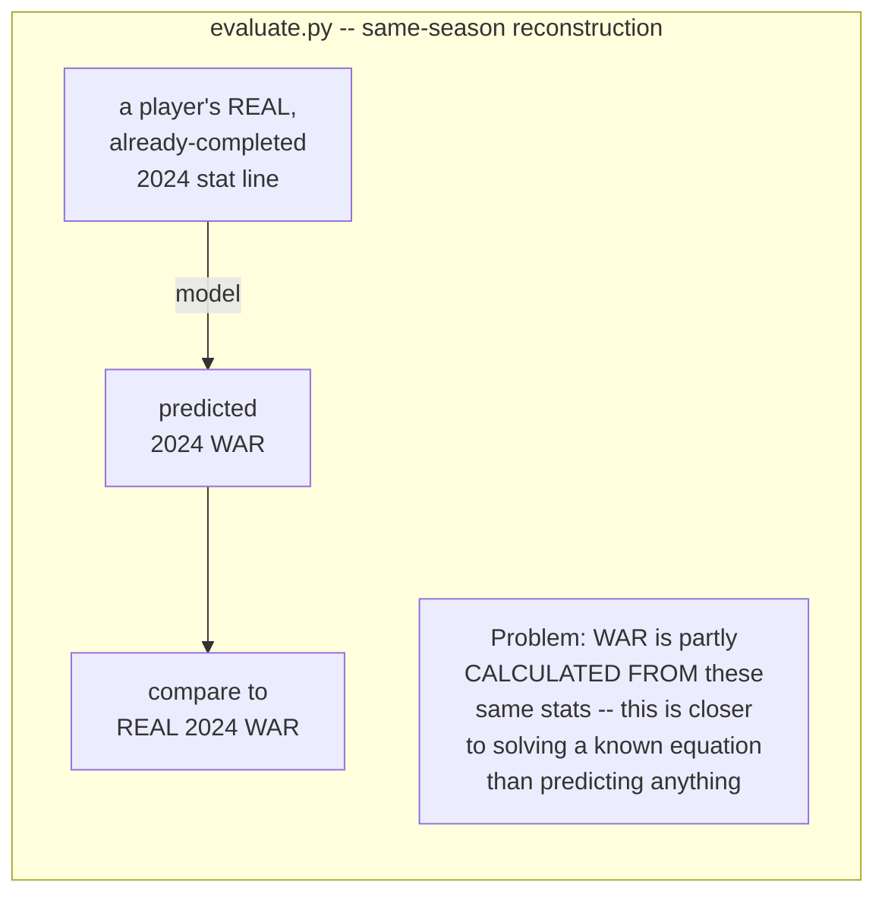
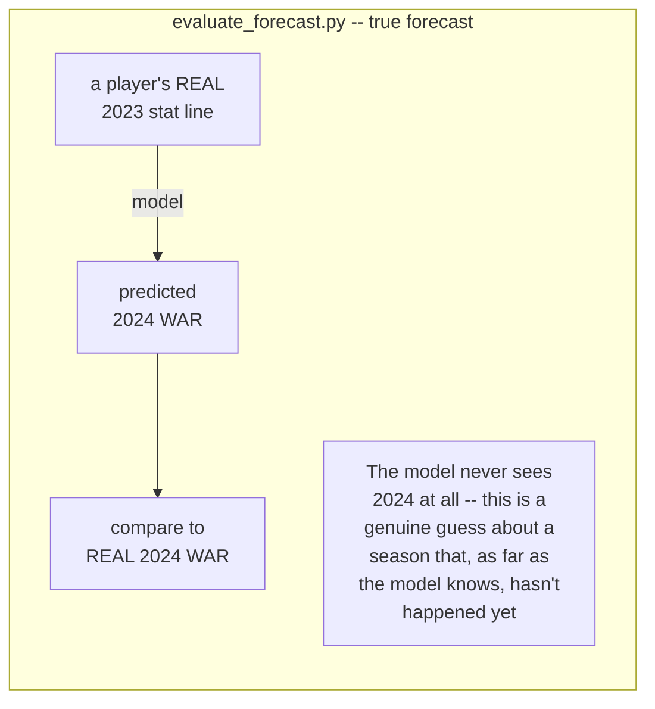

# Evaluation Walkthrough — Is the Model Actually Good?

This is the follow-up to `PIPELINE_WALKTHROUGH.md`, covering a different question:
once the pipeline runs end to end, **how do we actually know the WAR prediction model
is any good?** This started from a fair "big red flag" — the only validation the model
had was "the top of the list contains recognizable star names," which isn't real
evidence. This doc explains, in plain language, what real evaluation looks like, what
we found, and why some of the numbers being lower than they first appeared is a good
sign, not a bad one.

## Why "the top names look right" isn't good enough

A model that just rewards "more plate appearances and better stats" would also put
stars at the top of the list — stars tend to be good at everything at once. That
doesn't prove the model is making an accurate prediction, only that it isn't obviously
broken. Real evaluation means comparing a *specific* prediction against a *specific*
known-correct answer, many times, and measuring how far off it was.

## Two different tests, two very different answers

We built two evaluation scripts that ask what sound like the same question but
actually aren't:





The second one is harder because it's the *real* situation the pipeline is actually
in: when the pipeline runs on the 2026 season, it has never seen any real 2026 data.
It only has last year's numbers to work from -- exactly like the true-forecast test.

## The results: same-season vs. true forecast

| | Same-season reconstruction | **True forecast (real job)** |
|---|---|---|
| Batting R² | 0.82 | **0.38** |
| Pitching R² | 0.56 | **0.16** |

**Nothing broke between these two numbers.** We just switched from an easy question
to a hard, honest one. Both still clearly beat "dumb guess" baselines (predict the
league average; predict the player repeats last year) -- the model is adding real
value, just less than the inflated number suggested.

One interesting side-finding: for pitchers, "assume they repeat last season" scored
*worse* than just guessing the average. That's not a flaw in the model -- it's
evidence that pitcher performance genuinely swings harder year to year than hitter
performance, in real life, before any model gets involved.

## What "82%" and "36%" actually mean

Picture a scatter plot: real WAR on one axis, predicted WAR on the other, one dot per
player. A perfect model puts every dot on a straight diagonal line (100%). A useless
model produces a random cloud with no pattern (0%). Our true-forecast number (36% for
hitters) means the dots cluster around that line with real, meaningful signal, but
with real scatter -- an honest amount of "we don't know everything" baked in.

## Three ablation tests: does a specific change actually help?

An "ablation" means: change exactly one thing, keep everything else identical, and
measure whether accuracy actually improves. Each of these settles a question raised
along the way with real evidence instead of a guess.

### 1. Does the fielding feature actually help?

| Bat model | R² (true forecast) |
|---|---|
| Without fielding data | 0.304 |
| **With fielding data** | **0.358** |

Yes, confirmed under the harder test too -- not just an artifact of the easier one.

### 2. Do "skill-based" pitching stats beat the current ones?

The idea: ERA/WHIP/Wins/Losses are heavily influenced by luck, defense, and bullpen
support, not just the pitcher's own skill -- swapping them for strikeout/walk/home-run
*rates* (closer to a pitcher's true skill) seemed like it should help.

| Pitch features | Same-season R² | True-forecast R² |
|---|---|---|
| era / whip / w / l (current) | **0.56** | 0.164 |
| so9 / bb9 / hr9 (skill-based) | 0.47 | 0.162 |

Turns out: a wash. The reason is subtle and worth remembering -- Baseball-Reference's
pitcher WAR is itself calculated from actual runs allowed, so era/whip are almost
*definitionally* close to the target in the same-season test. In the true-forecast
test (the one that actually matters) it barely matters which set is used. **No change
made** -- there was no real evidence to justify one.

### 3. Does a fancier model (not just different features) do better?

Tested five models, identical features, identical train/test split:

| Model | Bat R² | Pitch R² |
|---|---|---|
| Ridge (current, linear) | **0.375** | 0.164 |
| ElasticNet (linear, auto-tuned) | 0.375 | 0.164 |
| RandomForest (tree-based) | 0.344 | 0.219 |
| XGBoost (tree-based) | 0.346 | **0.219** |
| Ridge+XGBoost blend | 0.370 | 0.208 |

**Batting: no gain from a fancier model.** Ridge (the simplest option) ties or wins
outright. ElasticNet landing identically to Ridge is itself a useful finding -- its
automatic feature-dropping didn't drop anything, meaning none of the current batting
features are dead weight.

**Pitching: a real, meaningful, TWICE-confirmed gain.** RandomForest and XGBoost --
two independently-built tree-based approaches -- landed on almost the exact same
improvement (0.164 → 0.219). Two different algorithms agreeing is much stronger
evidence than one algorithm alone; it means there's real non-linear structure in
pitching performance a straight-line model can't capture, not a quirk of one
particular tool.

**Shipped:** `forecast.py` now trains Ridge for batting (confirmed best) and XGBoost
for pitching (confirmed best, twice over). Verified after the switch: the pipeline
still runs clean end to end, and the top of the pitcher rankings is now Skubal,
Skenes, Crochet, Sánchez, Webb, Sale, Gilbert, Woo, Fried -- all legitimate ace-tier
arms, same kind of sanity check as always.

### 4. Are there more inputs already sitting in our own data?

Two places turned out to have unused signal, at no cost to source:

- `age` was already ingested on both the training side (`season_stats.age`) and the
  2026 inference side (`projections_raw.age`) -- just never used as a feature.
- The 2026 cheat-sheet CSVs actually contain runs, doubles, triples, RBI, and
  caught-stealing columns that `ingest.py`'s column mapping was silently dropping,
  even though the matching columns already existed in `season_stats` from
  Baseball-Reference.

| Bat features | R² (true forecast) |
|---|---|
| Without age/r/rbi/2B/3B/CS | 0.358 |
| **With age/r/rbi/2B/3B/CS** | **0.375** |

A real, if modest, gain -- confirmed cheaply first against historical data alone,
*then* wired into production: `ingest.py`'s CSV column mapping was widened to stop
dropping these columns, `ProjectionRaw` in `models.py` got the new columns (with the
same "patch the column onto the existing table" approach used for the fielding
column), and `forecast.py`'s two loaders and `BAT_FEATURES` were updated to match.
**This one is shipped** -- rerunning `ingest` → `resolve` → `forecast` → `valuation`
now reflects it.

## "Is it OK that our numbers are lower than professional systems?"

Short answer: **yes, and knowing why is more important than the number itself.**

Real projection systems (Steamer, ZiPS, THE BAT) are not hitting near-perfect
accuracy either -- forecasting a season of human athletic performance a year out is
genuinely hard for everyone, professional systems included. If asked to defend a
lower number than a well-funded system with a full data team, the strong answer isn't
"trust me, it's fine" -- it's demonstrating you understand exactly *why*:

1. **The feature set is intentionally minimal** -- box-score counting stats, not
   pitch-level Statcast data, multi-year weighted history, or minor-league
   translations real systems use.
2. **It clearly beats naive baselines** -- the actual bar for "is this adding value,"
   and it does, on both sides.
3. **The harder, more honest number got reported instead of the flattering one.**
   Catching your own model looking better than it really is, on purpose, before
   someone else catches it for you, is a stronger signal of competence than a high
   number alone would be.

## One more question: does the *product* work, not just the model?

Everything above evaluates the WAR model in isolation -- MAE/RMSE/R² on a raw number.
That's necessary but not sufficient: the actual product isn't "predict WAR," it's
"tell a team which trades are worth making." `src/evaluate_backtest.py` carries the
evaluation one layer further, through the real surplus-value math (`valuation.py`'s
aging curve + $/WAR conversion + real historical salary) and the real `recommend.py`
pairing logic, then checks both against what actually happened in 2022 and 2023 (the
two seasons with a full 3-year window of real salary data on the books to run the
production formula honestly).

```bash
python -m src.evaluate_backtest --target-season 2023
python -m src.evaluate_backtest --target-season 2022
```

### Result 1: surplus-value rank accuracy -- an honest, slightly negative finding

| Target season | Spearman(model surplus, realized value) | Spearman(naive "repeat last season" surplus, realized value) |
|---|---|---|
| 2023 | 0.214 | **0.239** |
| 2022 | 0.192 | **0.212** |

**The naive baseline slightly beat the trained model on this specific metric, in both
seasons tested.** This looks like it contradicts the R² results above, but it's
measuring something different, not overturning them:

- The R² tests score *how close* a single-season WAR prediction is to reality
  (squared error) -- the model clearly wins there, confirmed on two held-out seasons.
- This test scores *rank correlation of dollar surplus* -- year-1 WAR carried through
  the aging curve and real salary, then compared by ranking, not by error magnitude.
  Spearman only cares whether the ORDER is right, and "assume the player repeats last
  year" is a strong prior for ranking purposes specifically, even where its year-over-
  year *error* is worse in absolute terms (already established in the true-forecast
  ablation above: the model beats naive on R² for both roles).

Reporting a result that doesn't flatter the system is the same discipline this project
already committed to above -- an honest negative is worth more than a hidden one. The
practical read: surplus value should currently be treated as a *reasonable, not
precise* ranking signal, consistent with the aging curve already being a stated
heuristic rather than a validated one (see README's Known Limitations).

### Result 2: fair-trade pairing -- a real, positive finding

| Target season | Median realized-value gap, 20 model-picked "fair" pairs | Median realized-value gap, 500 random pairs |
|---|---|---|
| 2023 | **$5,262,000** | $8,881,000 |
| 2022 | **$4,432,500** | $8,355,000 |

Pairs `recommend.py` calls "fair" -- close *predicted*, pre-season surplus value --
stayed roughly **40-45% closer in *realized* value** than random pairs, in both
seasons tested. That's the specific, narrow claim `recommend.py` actually makes
("these two players' value is a realistic swap"), and it held up out-of-sample. This
result is more convincing than Result 1 because it's a relative, ranking-shaped claim
(A and B are close) rather than an absolute one (A is worth exactly $X) -- and ranking
is exactly what Spearman in Result 1 shows the model is weaker at than expected, yet
the *pairing* signal survives it. A useful, defensible instinct going forward: trust
this system's relative comparisons more than its absolute dollar figures.

### What isn't tested here

Only year 1 (the season the model actually predicts) is scored against reality. Years
2-3 of the real surplus formula are carried forward by the aging curve -- a stated,
non-learned assumption -- so there's nothing here that legitimately validates that
curve against real future outcomes without conflating it with the forecast model's own
accuracy. Historical `season_stats`/`war_actuals` also don't carry a player's position
(only the current 2026 cheat sheet does), so the fair-trade check above runs with
roster-fit filtering off -- it's testing the surplus-closeness claim specifically, not
the position-fit heuristic added later.

## Files in this evaluation

| File | What it does |
|---|---|
| `src/evaluate.py` | Same-season reconstruction backtest + fielding/pitch-feature ablations |
| `src/evaluate_forecast.py` | True N→N+1 forecast backtest (the honest number) + all ablations including the 5-model comparison |
| `src/evaluate_backtest.py` | Evaluates the *product*, not just the model: surplus-value rank accuracy and recommend.py's fair-trade pairing claim, both against real 2022/2023 outcomes |
