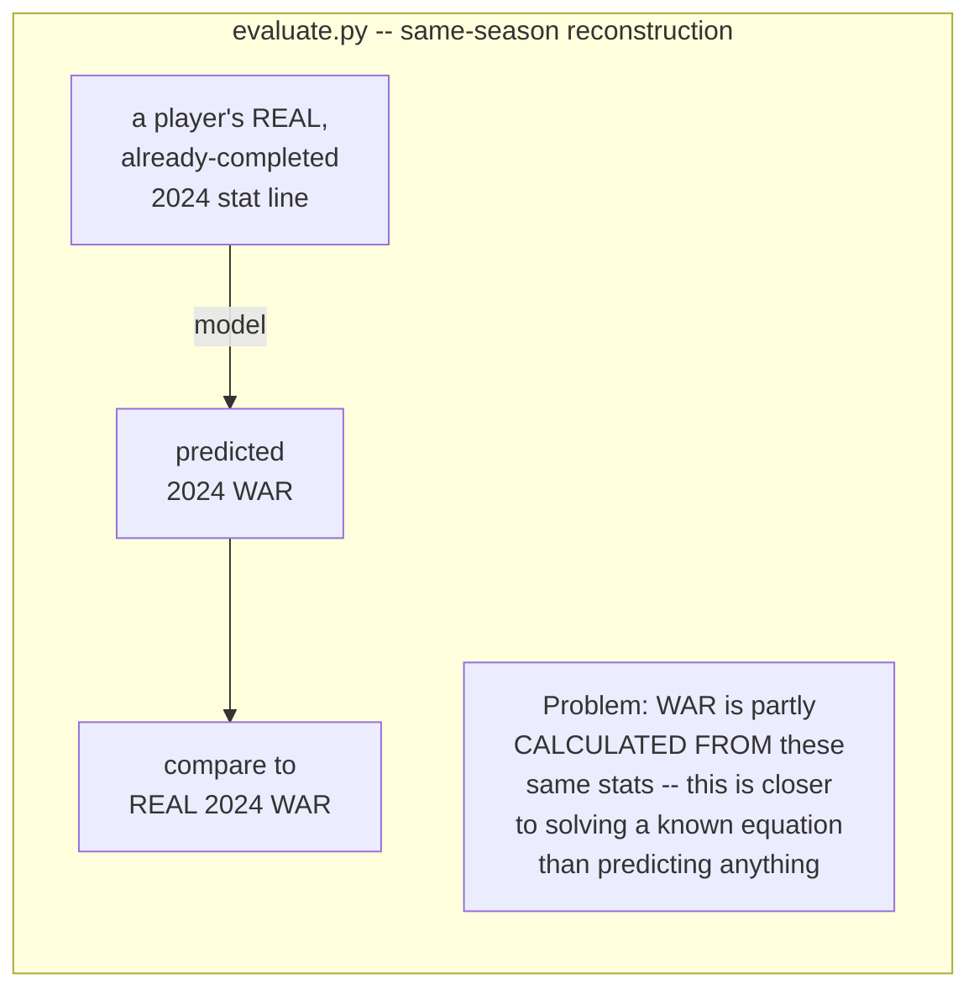
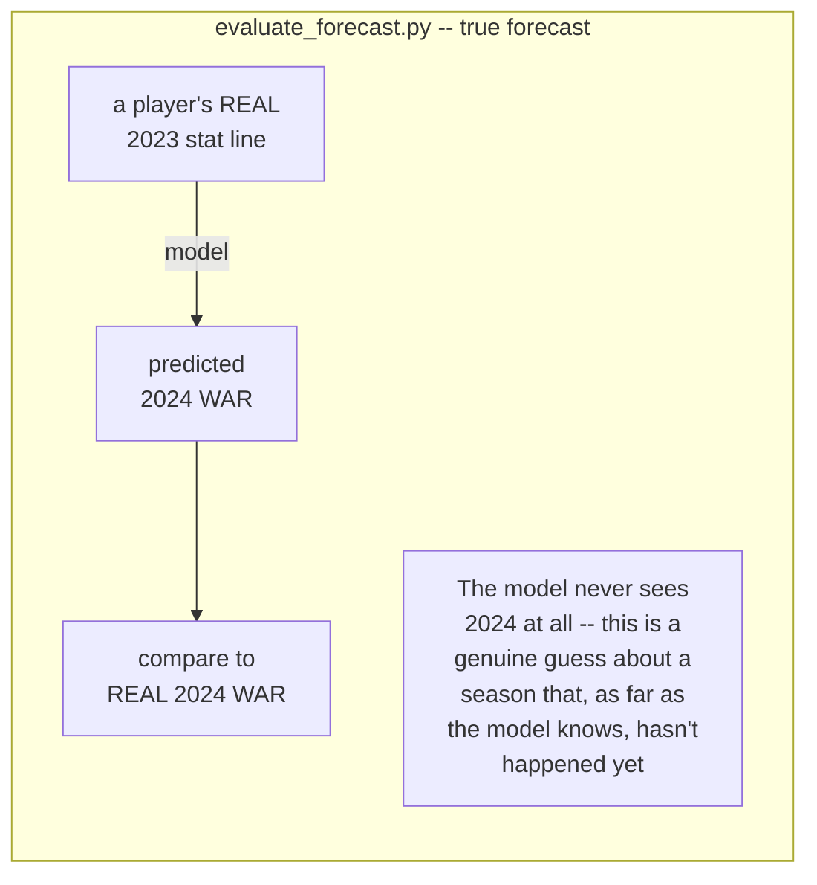

# Evaluation Walkthrough — Is the Model Actually Good?

This is the follow-up to `PIPELINE_WALKTHROUGH.md`, covering a different question:
once the pipeline runs end to end, **how do we actually know the WAR prediction model
is any good?** This started from a fair "big red flag" — the only validation the model
had was "the top of the list contains recognizable star names," which isn't real
evidence. This doc explains, in plain language, what real evaluation looks like, what
we found, and why some of the numbers being lower than they first appeared is a good
sign, not a bad one.

## Why "the top names look right" isn't good enough

A model that just rewards "more plate appearances and better stats" would also put
stars at the top of the list — stars tend to be good at everything at once. That
doesn't prove the model is making an accurate prediction, only that it isn't obviously
broken. Real evaluation means comparing a *specific* prediction against a *specific*
known-correct answer, many times, and measuring how far off it was.

## Two different tests, two very different answers

We built two evaluation scripts that ask what sound like the same question but
actually aren't:

The second one is harder because it's the *real* situation the pipeline is actually
in: when the pipeline runs on the 2026 season, it has never seen any real 2026 data.
It only has last year's numbers to work from -- exactly like the true-forecast test.

## The results: same-season vs. true forecast

| | Same-season reconstruction | **True forecast (real job)** |
|---|---|---|
| Batting R² | 0.82 | **0.36** |
| Pitching R² | 0.56 | **0.16** |

**Nothing broke between these two numbers.** We just switched from an easy question
to a hard, honest one. Both still clearly beat "dumb guess" baselines (predict the
league average; predict the player repeats last year) -- the model is adding real
value, just less than the inflated number suggested.

One interesting side-finding: for pitchers, "assume they repeat last season" scored
*worse* than just guessing the average. That's not a flaw in the model -- it's
evidence that pitcher performance genuinely swings harder year to year than hitter
performance, in real life, before any model gets involved.

## What "82%" and "36%" actually mean

Picture a scatter plot: real WAR on one axis, predicted WAR on the other, one dot per
player. A perfect model puts every dot on a straight diagonal line (100%). A useless
model produces a random cloud with no pattern (0%). Our true-forecast number (36% for
hitters) means the dots cluster around that line with real, meaningful signal, but
with real scatter -- an honest amount of "we don't know everything" baked in.

## Three ablation tests: does a specific change actually help?

An "ablation" means: change exactly one thing, keep everything else identical, and
measure whether accuracy actually improves. Each of these settles a question raised
along the way with real evidence instead of a guess.

### 1. Does the fielding feature actually help?

| Bat model | R² (true forecast) |
|---|---|
| Without fielding data | 0.304 |
| **With fielding data** | **0.358** |

Yes, confirmed under the harder test too -- not just an artifact of the easier one.

### 2. Do "skill-based" pitching stats beat the current ones?

The idea: ERA/WHIP/Wins/Losses are heavily influenced by luck, defense, and bullpen
support, not just the pitcher's own skill -- swapping them for strikeout/walk/home-run
*rates* (closer to a pitcher's true skill) seemed like it should help.

| Pitch features | Same-season R² | True-forecast R² |
|---|---|---|
| era / whip / w / l (current) | **0.56** | 0.164 |
| so9 / bb9 / hr9 (skill-based) | 0.47 | 0.162 |

Turns out: a wash. The reason is subtle and worth remembering -- Baseball-Reference's
pitcher WAR is itself calculated from actual runs allowed, so era/whip are almost
*definitionally* close to the target in the same-season test. In the true-forecast
test (the one that actually matters) it barely matters which set is used. **No change
made** -- there was no real evidence to justify one.

### 3. Does a fancier model (not just different features) do better?

Tested five models, identical features, identical train/test split:

| Model | Bat R² | Pitch R² |
|---|---|---|
| Ridge (current, linear) | **0.358** | 0.164 |
| ElasticNet (linear, auto-tuned) | 0.358 | 0.164 |
| RandomForest (tree-based) | 0.324 | 0.219 |
| XGBoost (tree-based) | 0.338 | **0.219** |
| Ridge+XGBoost blend | 0.357 | 0.208 |

**Batting: no gain from a fancier model.** Ridge (the simplest option) ties or wins
outright. ElasticNet landing identically to Ridge is itself a useful finding -- its
automatic feature-dropping didn't drop anything, meaning none of the current batting
features are dead weight.

**Pitching: a real, meaningful, TWICE-confirmed gain.** RandomForest and XGBoost --
two independently-built tree-based approaches -- landed on almost the exact same
improvement (0.164 → 0.219). Two different algorithms agreeing is much stronger
evidence than one algorithm alone; it means there's real non-linear structure in
pitching performance a straight-line model can't capture, not a quirk of one
particular tool.

**Open decision, not yet made:** switch `forecast.py`'s pitch model from Ridge to a
tree-based model, keeping Ridge for batting. The evidence supports it; the change
hasn't been applied yet.

## "Is it OK that our numbers are lower than professional systems?"

Short answer: **yes, and knowing why is more important than the number itself.**

Real projection systems (Steamer, ZiPS, THE BAT) are not hitting near-perfect
accuracy either -- forecasting a season of human athletic performance a year out is
genuinely hard for everyone, professional systems included. If asked to defend a
lower number than a well-funded system with a full data team, the strong answer isn't
"trust me, it's fine" -- it's demonstrating you understand exactly *why*:

1. **The feature set is intentionally minimal** -- box-score counting stats, not
   pitch-level Statcast data, multi-year weighted history, or minor-league
   translations real systems use.
2. **It clearly beats naive baselines** -- the actual bar for "is this adding value,"
   and it does, on both sides.
3. **The harder, more honest number got reported instead of the flattering one.**
   Catching your own model looking better than it really is, on purpose, before
   someone else catches it for you, is a stronger signal of competence than a high
   number alone would be.

## Files in this evaluation

| File | What it does |
|---|---|
| `src/evaluate.py` | Same-season reconstruction backtest + fielding/pitch-feature ablations |
| `src/evaluate_forecast.py` | True N→N+1 forecast backtest (the honest number) + all ablations including the 5-model comparison |
