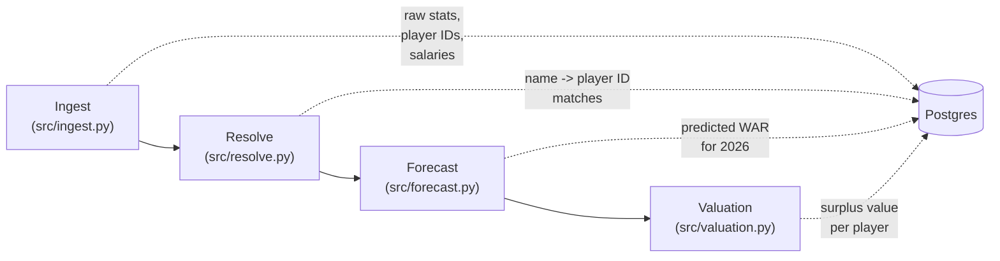
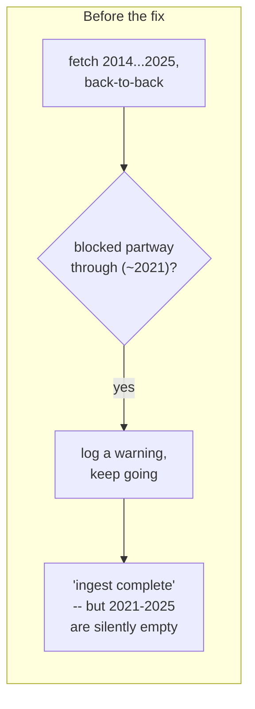
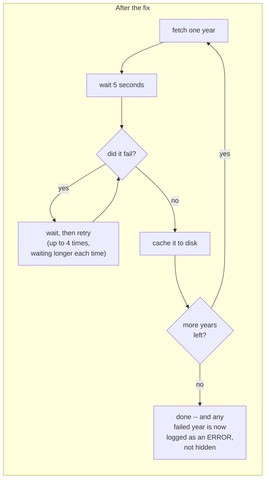
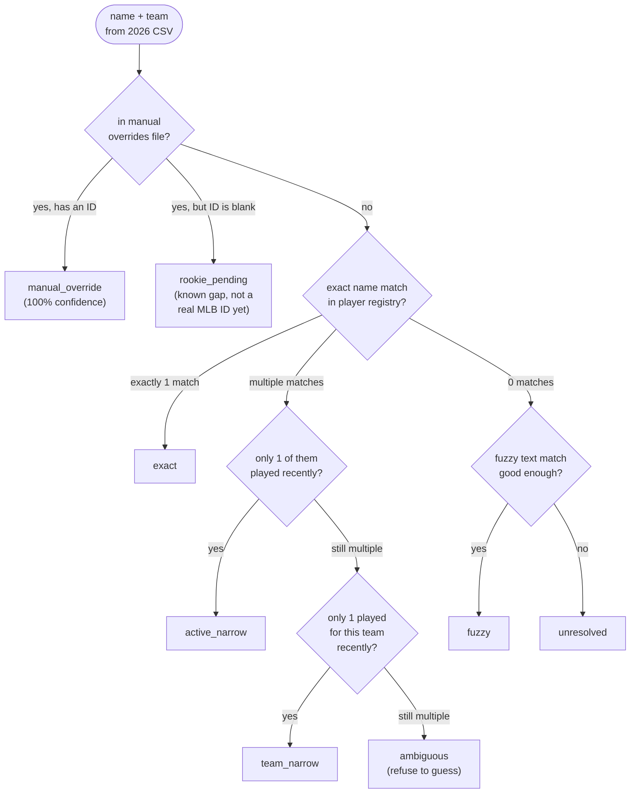
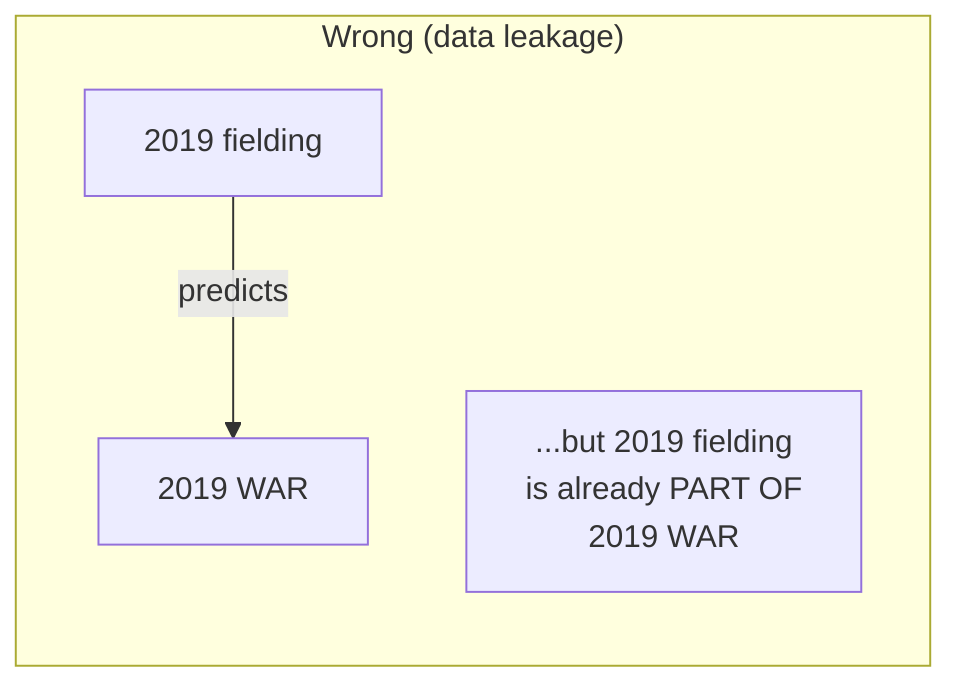
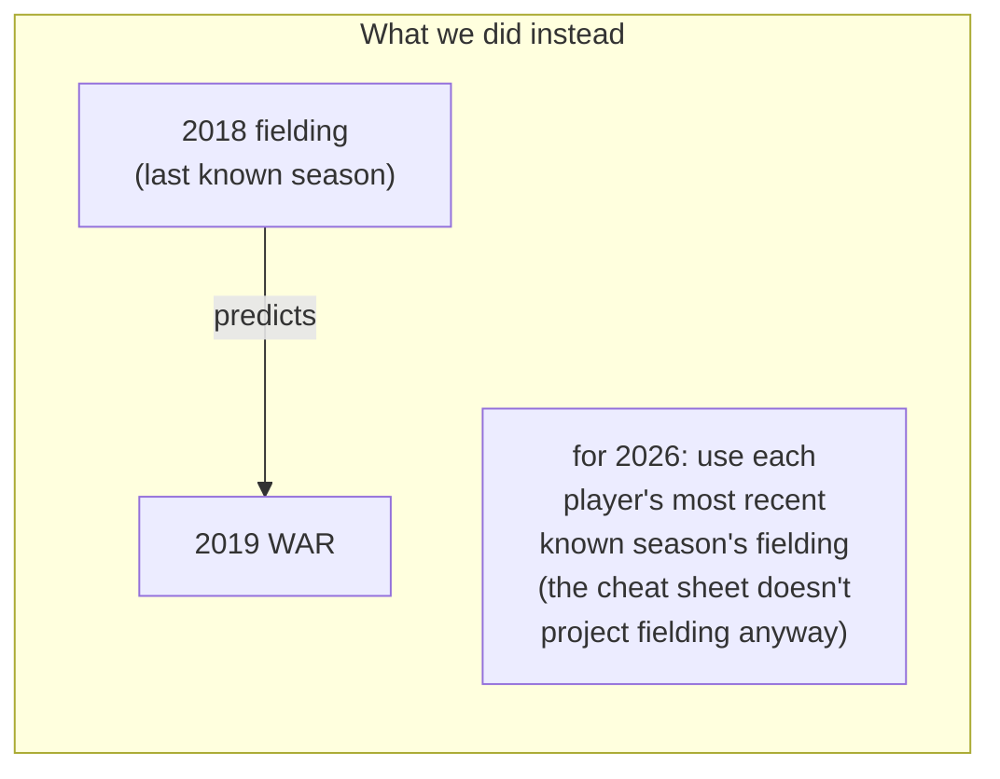
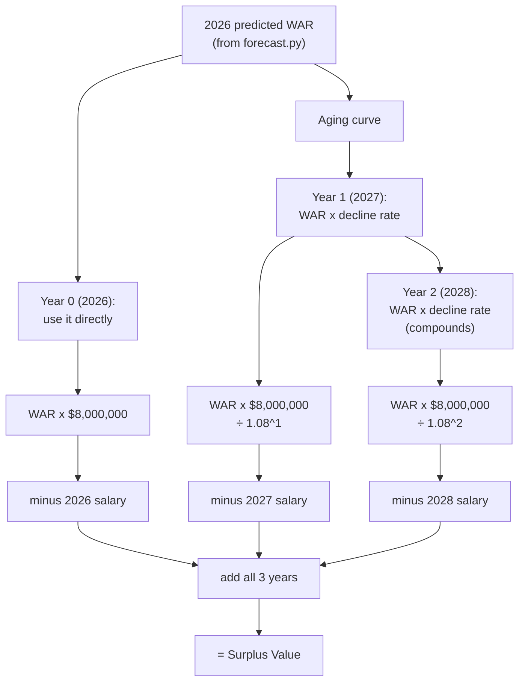

# Pipeline Walkthrough — What We Built

This explains, in plain language, everything that happened to get this project's data
pipeline running end to end: from raw baseball data on the internet to a dollar-value
"is this player worth trading for" number.

## The big picture

Four stages, each one a Python file, each one feeding the next:

**In one sentence each:**
- **Ingest** — pulls raw data (player IDs, historical stats, WAR, salaries, 2026 projections) from the internet and Postgres.
- **Resolve** — figures out which raw projection row ("Bobby Witt Jr., SS, KC") corresponds to which real player ID, since two different sources spell/format names differently.
- **Forecast** — trains a small model on 12 years of history to turn box-score stats into a single predicted WAR number for 2026.
- **Valuation** — turns that WAR number into a dollar figure: is this player worth more than they're being paid?

Below is what we actually did at each stage, including the bugs we found and fixed.

---

## Stage 1: Ingest — pulling in the raw data

`ingest.py` pulls four things: the player ID registry (Chadwick), historical actual
WAR + salary (Baseball-Reference), 12 years of season stats (2014–2025), and the 2026
projection CSVs you already had.

### The bug: rate limiting silently ate 2021–2025

The original code fetched stats for all 12 years back-to-back with zero delay between
requests. Baseball-Reference doesn't like that and started blocking the requests — and
the code's `try/except` just logged a warning and moved on, so the pipeline "succeeded"
while quietly missing half its training data. Nobody would have noticed until the model
trained on it started acting weird.

**Result:** reran it, all 12 years came back clean — 19,822 rows across 2014–2025,
confirmed 2021–2025 are no longer missing.

---

## Stage 2: Resolve — matching names to player IDs

The 2026 projection spreadsheet just has player names as text ("Bobby Witt Jr.",
"Matt Boyd"). To connect that to historical stats, we need each name matched to the
player's permanent MLB ID number. This is harder than it sounds — misspellings,
nicknames, and two different people sharing a name are all real problems.

`resolve.py` tries a series of increasingly loose matching strategies, in order,
stopping at the first one that's confident enough:

### What we found when we ran it

**789 → 793 of 803 players (98.3% → 98.8%) matched automatically.** The 14 leftovers
split into two very different kinds of problem:

- **10 genuine rookies** — players so new they don't have an ID in the registry yet
  (Charlie Condon, Walker Jenkins, etc.). Nothing to fix here except wait for them to
  debut.
- **4 real players the algorithm got wrong for fixable reasons:**
  - "Matthew Boyd" / "Michael King" — the registry uses their nicknames, "Matt"/"Mike"
  - "Luis Castillo" / "Luis Garcia Jr." — two *different* real players share each name;
    we manually confirmed the correct one by checking which one actually plays for the
    team the projection said (Seattle, Washington)

We built `data/manual_overrides.csv` as a small manual answer-key for exactly these 14
cases, and taught `resolve.py` to check it first, before trying to guess. The 4 known
fixes now resolve correctly; the 10 rookies are clearly labeled as "known, not yet
possible" instead of blending in with genuine mismatches.

---

## Stage 3: Forecast — predicting 2026 WAR

`forecast.py` trains a small regression model: feed it a player's box-score stats
(hits, walks, ERA, etc.) from a season, teach it to predict that season's real WAR.
Then run the 2026 projections through it to get a 2026 WAR prediction per player.

### The gap we found: no fielding

WAR (the number the model is trying to predict) already includes fielding value —
a great defensive shortstop scores higher than a mediocre one with the identical bat
line. But the stats we were *feeding* the model were 100% offense (hits, walks, home
runs...). The model had no way to tell a plus defender from a butcher, so it just
guessed "average fielder" for everyone.

The fix uses a `runs_above_avg_def` fielding number that was sitting unused in data we
already had. But there's a subtlety: you can't use a player's **same-season** fielding
number to predict their **same-season** WAR — fielding is literally part of what makes
up WAR, so that would be like handing the model part of the answer.

Rookies with no fielding history yet just get treated as "average" (this is a standard
statistics trick called mean-imputation — already built into the pipeline for other
missing values too).

**Result:** after adding this, several well-known plus defenders (Bobby Witt Jr.,
Mookie Betts, Julio Rodríguez, Gunnar Henderson) moved into the top 10 predicted
players — proof the fielding signal is actually doing something, not just a code
change with no effect.

---

## Stage 4: Valuation — turning WAR into dollars

This is the "should we trade for this player" answer. The formula, in words: *for each
of the next 3 seasons, take their predicted WAR, convert it to dollars, discount it a
little for uncertainty, then subtract what they actually get paid that year. Add the
3 years up.*

### Piece 1: the aging curve

A player's WAR doesn't stay flat forever — it typically peaks around age 27 and
declines afterward, and the decline gets steeper the further past peak they are. We
built a simple formula for this (not a trained model — an honest, explainable
assumption) and calibrated it to match a worked example already written in the
project's planning notes: age 30 loses 7% of the prior year's value, age 31 loses 10%.
Only years 2 and 3 get aged — year 1 (2026) is left untouched since it's already a
single-season prediction.

### Piece 2: where does salary data come from?

This took a couple of tries:

1. **First idea: a well-known public salary database (the "Lahman" database).**
   Turned out to be a dead end — the website it downloads from doesn't exist anymore
   (confirmed directly: the GitHub page for it 404s). Not our bug, just an old,
   unmaintained public data source.
2. **What actually worked:** the same Baseball-Reference data we were already pulling
   in Stage 1 (`war_actuals`) has a salary field bundled in for free — including
   **current 2026 salaries** for 482 already-signed players. Spot-checked it against
   real known numbers (Juan Soto $51.9M, Aaron Judge $40M) and it matched.
3. **The remaining gap:** that free data only covers *this* season. A multi-year
   contract's 2027/2028 salary isn't in there, since bref only reports what a player
   is actually being paid *right now*. For those, we built a small manual file
   (`data/manual_contracts.csv`) — you look up specific players' future guaranteed
   salary on public sites (Spotrac, Cot's Contracts) only for the players you're
   actually testing trades on, not the whole league.
4. **Fallback for anything still missing:** MLB's league minimum salary, clearly
   flagged in the output (`salary_estimated = True`) rather than silently guessed.

### First real results

Ran it against all 792 resolved 2026 players. Top of the list by surplus value:
**Bobby Witt Jr., Elly De La Cruz, Gunnar Henderson, Wyatt Langford, Fernando Tatís
Jr., Shohei Ohtani...** — all genuinely elite, still-cheap young players. That's exactly
the right answer: surplus value should reward *great AND affordable*, not just great.
Ohtani himself — a top-3 talent in baseball — ranks 6th, not 1st, because his real
salary is already large and eats into the surplus.

**Honest caveat right now:** `manual_contracts.csv` is still empty, so every player's
2027/2028 salary is currently the league-minimum placeholder — every result is
currently flagged `salary_estimated = True`. The numbers will tighten up once real
out-year salaries are added for whichever players get tested.

---

## Files touched, at a glance

| File | What changed |
|---|---|
| `src/ingest.py` | Added retry/backoff + pacing for Baseball-Reference requests; added fielding data to the WAR pull; added a schema-patch helper since there's no migration tool |
| `src/resolve.py` | Added a manual-overrides check that runs before the automatic matching |
| `src/forecast.py` | Added a lagged (prior-season) fielding feature to the batting model |
| `src/valuation.py` | Built out from an empty stub: aging curve, surplus formula, salary lookup (auto + manual), results persistence |
| `src/models.py` | Added `def_runs` column to `war_actuals`; added the new `valuations` table |
| `data/manual_overrides.csv` | New — 14 name-matching exceptions (4 solved, 10 tracked rookies) |
| `data/manual_contracts.csv` | New — empty template for out-year (2027/2028) salaries you look up by hand |

## What's still open

- `data/manual_contracts.csv` needs real 2027/2028 numbers for whichever players get
  tested in actual trade scenarios.
- The 10 tracked rookies will resolve automatically once they debut and get a real
  MLB ID (no code changes needed — just fill in `data/manual_overrides.csv`).
- `src/main.py` (the API) is still an empty stub — the last piece connecting this
  pipeline to something interactive.
