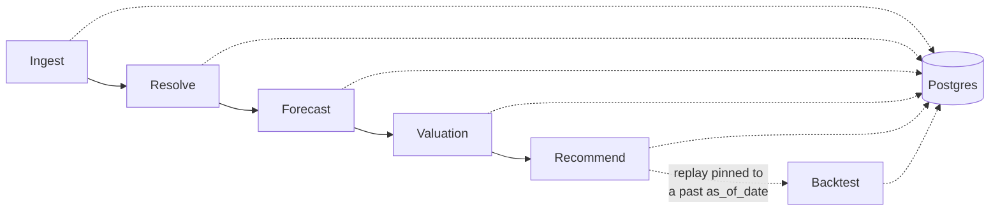

# Baseball Trade Recommendation Platform

A data pipeline that estimates how much surplus value an MLB player represents as a
trade target — combining historical performance, a fielding-aware WAR projection
model, and salary data into a single dollar figure teams could use to evaluate
whether a player is worth acquiring.

Surplus value answers a specific question: *not* "who's the best player," but
"who's worth more than they're being paid?" A superstar already earning superstar
money is a bad trade target even though they're a great player; a young, cheap,
high-performing player is where the actual trade value lives.

## How it works

Five stages, each a standalone script, each reading from and writing to a shared
Postgres database:



| Stage | Script | What it does |
|---|---|---|
| **Ingest** | `src/ingest.py` | Pulls the player ID registry, 12 years of historical stats + actual WAR + salary, and this year's projection CSVs |
| **Resolve** | `src/resolve.py` | Matches each projection's player name to a canonical MLB player ID (handles nicknames, misspellings, and same-name collisions) |
| **Forecast** | `src/forecast.py` | Trains a regression model on historical stats → realized WAR, then predicts this season's WAR for every projected player |
| **Valuation** | `src/valuation.py` | Projects WAR forward across a multi-year horizon with an aging curve, converts it to dollars, and subtracts salary to get surplus value |
| **Recommend** | `src/recommend.py` | Finds plausible 1-for-1 trade candidates: pairs of players on different teams whose surplus values are closest together |
| **Backtest** | `src/backtest.py` | Replays `recommend.py` pinned to a past decision date (`--as-of`), proving the read path never sees a valuation written after that date |

### Why "recommend" looks for the closest surplus value, not the biggest gain

Surplus value is a *universal* number — it doesn't depend on which team holds the
player. That has a consequence worth stating plainly: under one shared value, a
1-for-1 trade can never make *both* sides better off except by exact coincidence.
Whatever surplus Team A gains by receiving a player, Team B loses exactly that —
it's zero-sum by construction, not a modeling bug. So `recommend.py` doesn't hunt
for a "both sides gain" trade (structurally not something a value-only model can
produce); it finds the closest achievable thing — 1-for-1 swaps between two
different teams whose surplus values are nearly equal *and* whose eligible
positions overlap, i.e. plausible, roughly-even trades. Eligibility is each
player's primary position plus every position listed in the cheat sheet's
"OTHER POS" column, which also captures multi-position and two-way players
(e.g. Ohtani: DH + SP). This is still a coarse heuristic — it says "could
plausibly occupy the same roster spot," not "a real GM would make this specific
trade," and there's no team-level positional-need modeling — but it removes the
obviously-wrong matches a value-only ranking produces, like pairing a reliever
with a catcher purely because the dollar figures happen to be close. Pass
`--any-position` to disable the filter and rank by surplus-value closeness only.

## Data sources

- **[Chadwick Bureau Register](https://github.com/chadwickbureau/register)** (via `pybaseball`) — the canonical crosswalk of player IDs across data sources
- **Baseball-Reference bWAR** (via `pybaseball`) — historical actual WAR, salary, and fielding value, batting and pitching
- **Baseball-Reference season stats** (via `pybaseball`) — 12 seasons (2014–present) of box-score stats used to train the WAR model
- **Mr. Cheat Sheet** — a fantasy-baseball projection CSV for the upcoming season (`data/raw/*.csv`), the input the model turns into a WAR estimate

## Design decisions

These are deliberate, explainable choices rather than arbitrary constants:

- **$8M / WAR** (`DOLLARS_PER_WAR`) — the going market rate for a win, sourced from
  free-agent market analysis (Fangraphs / MLB Trade Rumors). Literature range is
  roughly $8M–$10M.
- **8% discount rate** (`DISCOUNT_RATE`) — future WAR is discounted for projection
  uncertainty and time value.
- **3-year valuation horizon** — projection accuracy degrades meaningfully past
  ~3 years, so surplus value is only computed that far out.
- **Aging curve** — a simple, explainable formula (flat through peak at age 27, then
  linearly increasing decline) rather than a learned model. This is a stated
  simplification, not a claim of precision — it's transparent about what it is.
- **Point-in-time data** — every ingested fact carries an `as_of_date`, so historical
  snapshots are preserved rather than overwritten. This is what makes it possible to
  eventually backtest a recommendation against what was actually knowable at the time,
  without leaking future information into a past decision.

## Model evaluation

The honest question for any prediction model is "how do you know it's any good?" —
not "do the top names look like real stars," which is weak evidence at best. Two
scripts answer this with real held-out testing against actual historical outcomes:

- **`src/evaluate.py`** — trains on 2014–2023, tests on 2024–2025, scoring
  predicted vs. actual WAR for players in those held-out seasons. Also runs two
  ablations: does the fielding feature actually help, and does swapping in more
  skill-driven pitcher stats (strikeout/walk/home-run rates instead of ERA/WHIP/W-L)
  help.
- **`src/evaluate_forecast.py`** — the harder, more honest version. The test above
  reconstructs a season's WAR from that *same* season's real stats, which is close
  to solving a known equation (WAR is partly defined by those stats) rather than
  forecasting. This script instead trains on season *N*'s stats predicting season
  *N+1*'s WAR — the same shape of problem the 2026 projections actually pose — and
  is the number that should be trusted as the real accuracy ceiling.

Both compare the model against two naive baselines (predict the league average;
predict the player repeats last season) — a model that can't beat those isn't
adding value.

| | Same-season reconstruction | **True forecast (N → N+1)** |
|---|---|---|
| Batting R² | 0.82 | **0.38** |
| Pitching R² | 0.56 | **0.16** |

**The true-forecast numbers are the ones that matter** for what this pipeline
actually does. Both still clearly beat the naive baselines (batting: naive best is
R²=0.22; pitching: naive best is R²=-0.21, since pitcher performance is genuinely
volatile year to year even before a model is involved) — so the model is adding
real signal, just less than the same-season number would suggest on its own.

**Ablation findings:**
- The fielding feature (`prior_def_runs`) holds up under the harder test too —
  batting R² 0.33 → 0.38 with it included. Not an artifact of the easier evaluation.
- Swapping ERA/WHIP/W-L for skill-driven pitcher rate stats is a wash in the true
  forecast (R² 0.164 vs 0.162) despite losing clearly in same-season reconstruction
  (0.56 vs 0.47) — the current feature set stays as-is; there's no evidence a swap
  would help.
- **Batting: age, runs, RBI, doubles, triples, and caught-stealing** — sitting
  unused in data already ingested (`season_stats`) and in the raw 2026 CSV (dropped
  by `ingest.py`'s column mapping) — measurably helped (R² 0.358 → 0.375) and are now
  **live in `BAT_FEATURES`**, with the ingest/schema/loader plumbing to match
  (`ingest.py`'s `_HIT_RENAME`, new `ProjectionRaw` columns, `forecast.py`'s loaders).
- **Model comparison** (Ridge vs. ElasticNet vs. RandomForest vs. XGBoost vs. a
  Ridge+XGBoost blend, same features, same split): for batting, Ridge ties or beats
  every alternative — no evidence a fancier model helps. For pitching, two
  independent tree-based models (RandomForest and XGBoost) both landed on the same
  improvement over Ridge (R²=0.164 → 0.219), which is stronger evidence than either
  alone that pitching has real non-linear structure a straight-line model misses.
  **Shipped** — `forecast.py` now trains Ridge for batting and XGBoost for pitching.

Run either with `python -m src.evaluate` / `python -m src.evaluate_forecast`. Full
narrative writeup, including why the numbers dropping between the two tests is
expected (not a bug) and how to defend a lower-than-professional-systems number in an
interview: see **`EVALUATION_WALKTHROUGH.md`**. For the data pipeline itself
(ingest → resolve → forecast → valuation), see **`PIPELINE_WALKTHROUGH.md`**.

The two evaluations above score the WAR model in isolation. **`src/evaluate_backtest.py`**
goes one layer further and scores the *product* — surplus value and recommend.py's
fair-trade pairing — against real 2022/2023 outcomes:

```bash
python -m src.evaluate_backtest --target-season 2023
```

Headline results (full writeup in `EVALUATION_WALKTHROUGH.md`): the naive "repeat last
season" baseline actually edges out the model on surplus-value rank correlation — an
honest negative reported rather than hidden — but pairs `recommend.py` calls "fair"
based on predicted surplus stayed **~40-45% closer in realized value** than random
pairs, in both seasons tested. The practical takeaway: trust this system's *relative*
comparisons (is A a fair trade for B?) more than its *absolute* dollar figures.

## Getting started

**Requirements:** Docker Desktop, Python 3.12+

```bash
# 1. start Postgres
cp .env.example .env
docker compose up -d

# 2. set up the environment
python3 -m venv .venv
source .venv/bin/activate        # Windows: .venv\Scripts\Activate.ps1
pip install -r requirements.txt

# 3. run the pipeline, in order
python -m src.ingest
python -m src.resolve
python -m src.forecast
python -m src.valuation
python -m src.recommend                 # league-wide fairest trades
python -m src.recommend --team NYM       # fairest trades involving one team
python -m src.recommend --any-position   # disable roster-fit filtering
```

## API

`src/main.py` is a thin FastAPI layer over the same functions the CLI scripts use —
no separate implementation of "what's a player's surplus value" or "what's a fair
trade." Three read-only endpoints:

| Endpoint | What it returns |
|---|---|
| `GET /players/{mlbam_id}/valuation` | One player's latest surplus value |
| `GET /recommend?team=&top_n=&any_position=` | Fairest 1-for-1 trades today (same as `python -m src.recommend`) |
| `GET /backtest?as_of=&team=&top_n=&any_position=` | Fairest trades as of a past decision date (same as `python -m src.backtest`) |

Run the whole stack — Postgres + API — with Docker:

```bash
docker compose up -d --build
open http://localhost:8000/docs   # interactive Swagger UI
```

Or run just the API locally against a Postgres already started with `docker compose up
-d` (uses `.env`'s `localhost:15432`, not the container-to-container `postgres:5432`
that `docker-compose.yml`'s `api` service uses):

```bash
uvicorn src.main:app --reload
```

Each stage logs a summary as it runs — row counts, match rates, top players by
surplus value, and (for recommend) the closest-value trade candidates found.

## Manually curated data

Two files fill gaps that no public API covers:

- **`data/manual_overrides.csv`** — player-name matches the automated resolver can't
  make confidently on its own (nickname mismatches, two players sharing a name).
  Rebuilds automatically the moment a name is added here — just rerun
  `python -m src.resolve`.
- **`data/manual_contracts.csv`** — future-year salary (beyond the current season)
  for specific players, since no public source provides forward-looking guaranteed
  contract money in a queryable format. Current-season salary is pulled automatically;
  this file only needs entries for players you're actively evaluating trades for.

## Project structure

```
src/
  config.py     # env vars, paths, the $/WAR and discount-rate constants
  db.py         # SQLAlchemy engine
  models.py     # ORM table definitions
  ingest.py     # stage 1
  resolve.py    # stage 2
  forecast.py   # stage 3
  valuation.py  # stage 4
  recommend.py  # stage 5
  backtest.py   # stage 6 -- replay recommend.py pinned to a past as_of_date
  evaluate.py            # same-season backtest + ablations
  evaluate_forecast.py   # true N -> N+1 forecast backtest (the honest number)
  evaluate_backtest.py   # scores surplus value + fair-trade pairing against real outcomes
  main.py       # FastAPI layer -- 3 endpoints over the same functions the CLI uses
data/
  raw/          # source CSVs (season projections)
  snapshots/    # parquet snapshots of every ingest run, by date
  manual_overrides.csv
  manual_contracts.csv
tests/
  test_backtest_pit.py   # proves the point-in-time read path can't see future-dated rows
```

## Currently in progress

- **`data/manual_contracts.csv`** — currently empty; needs real 2027/2028 salary
  figures for whichever players get evaluated in actual trade scenarios.
- A small number of just-drafted prospects are tracked in `data/manual_overrides.csv`
  with no player ID yet, since they haven't appeared in the public registry — these
  resolve automatically once they debut and gain one.
- **No auth, no writes** on the API — read-only endpoints over already-computed
  valuations, matching the "it's a demo" scope decision (see Known limitations).

## Backtesting and the point-in-time guarantee

`recommend.py`'s loader never does a bare "give me the latest valuations" read —
every query resolves to `MAX(as_of_date) WHERE as_of_date <= :cutoff`, where the
default cutoff (today) reproduces the old "just give me latest" behavior, but any
earlier cutoff can only ever see rows that existed as of that date. `src/backtest.py`
exercises this directly: it re-runs the exact same recommend.py query path pinned to
a `--as-of` date you choose.

```bash
python -m src.backtest --as-of 2026-08-15
python -m src.backtest --as-of 2026-08-15 --team NYM
```

`tests/test_backtest_pit.py` is the regression test for this: it inserts one
valuations row dated in the past and one dated far in the future for a throwaway
player, then asserts a cutoff between them returns the past row and never the future
one — the specific failure mode a bare `MAX(as_of_date)` would be blind to.

**Honest scope note:** this pipeline has been run once, so there's currently only one
populated `as_of_date` in `valuations` — there's no historical *projection* data (what
a system like Steamer said about a player before a past season started) to replay a
real past season against. `season_stats` / `war_actuals` hold realized, after-the-fact
performance for 2014–2025, not point-in-time projections, so they can't stand in for
that. What's proven today is narrower and still real: the read path is provably
incapable of leaking a future-dated row into a past decision. As this pipeline gets
run repeatedly over time and accumulates more `valuations` snapshots, `--as-of`
starts replaying actual history instead of just re-deriving today's answer.

## Known limitations

- The aging curve is an explainable heuristic, not learned from data.
- Multi-player trades (2-for-1 and larger) are out of scope — the search space grows
  combinatorially; this focuses on cleanly demonstrating 1-for-1 valuation instead.
- The backtest harness proves point-in-time query correctness, not a validated replay
  of a real past season (see above) — there's only one `valuations` snapshot so far.
- No auth, frontend, or cloud deployment — this is a local, containerized demo
  (Docker + Postgres + the pipeline scripts).
