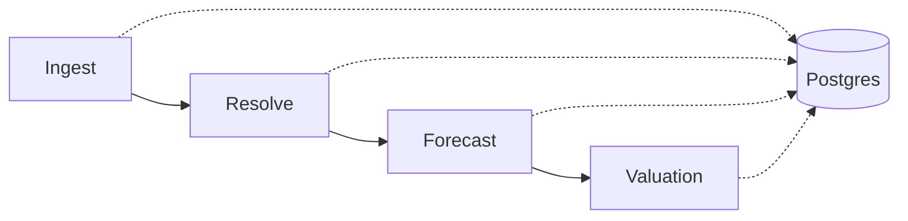

# Baseball Trade Recommendation Platform

A data pipeline that estimates how much surplus value an MLB player represents as a
trade target — combining historical performance, a fielding-aware WAR projection
model, and salary data into a single dollar figure teams could use to evaluate
whether a player is worth acquiring.

Surplus value answers a specific question: *not* "who's the best player," but
"who's worth more than they're being paid?" A superstar already earning superstar
money is a bad trade target even though they're a great player; a young, cheap,
high-performing player is where the actual trade value lives.

## How it works

Four stages, each a standalone script, each reading from and writing to a shared
Postgres database:



| Stage | Script | What it does |
|---|---|---|
| **Ingest** | `src/ingest.py` | Pulls the player ID registry, 12 years of historical stats + actual WAR + salary, and this year's projection CSVs |
| **Resolve** | `src/resolve.py` | Matches each projection's player name to a canonical MLB player ID (handles nicknames, misspellings, and same-name collisions) |
| **Forecast** | `src/forecast.py` | Trains a regression model on historical stats → realized WAR, then predicts this season's WAR for every projected player |
| **Valuation** | `src/valuation.py` | Projects WAR forward across a multi-year horizon with an aging curve, converts it to dollars, and subtracts salary to get surplus value |

## Data sources

- **[Chadwick Bureau Register](https://github.com/chadwickbureau/register)** (via `pybaseball`) — the canonical crosswalk of player IDs across data sources
- **Baseball-Reference bWAR** (via `pybaseball`) — historical actual WAR, salary, and fielding value, batting and pitching
- **Baseball-Reference season stats** (via `pybaseball`) — 12 seasons (2014–present) of box-score stats used to train the WAR model
- **Mr. Cheat Sheet** — a fantasy-baseball projection CSV for the upcoming season (`data/raw/*.csv`), the input the model turns into a WAR estimate

## Design decisions

These are deliberate, explainable choices rather than arbitrary constants:

- **$8M / WAR** (`DOLLARS_PER_WAR`) — the going market rate for a win, sourced from
  free-agent market analysis (Fangraphs / MLB Trade Rumors). Literature range is
  roughly $8M–$10M.
- **8% discount rate** (`DISCOUNT_RATE`) — future WAR is discounted for projection
  uncertainty and time value.
- **3-year valuation horizon** — projection accuracy degrades meaningfully past
  ~3 years, so surplus value is only computed that far out.
- **Aging curve** — a simple, explainable formula (flat through peak at age 27, then
  linearly increasing decline) rather than a learned model. This is a stated
  simplification, not a claim of precision — it's transparent about what it is.
- **Point-in-time data** — every ingested fact carries an `as_of_date`, so historical
  snapshots are preserved rather than overwritten. This is what makes it possible to
  eventually backtest a recommendation against what was actually knowable at the time,
  without leaking future information into a past decision.

## Getting started

**Requirements:** Docker Desktop, Python 3.12+

```bash
# 1. start Postgres
cp .env.example .env
docker compose up -d

# 2. set up the environment
python3 -m venv .venv
source .venv/bin/activate        # Windows: .venv\Scripts\Activate.ps1
pip install -r requirements.txt

# 3. run the pipeline, in order
python -m src.ingest
python -m src.resolve
python -m src.forecast
python -m src.valuation
```

Each stage logs a summary as it runs — row counts, match rates, and (for valuation)
the top players by surplus value.

## Manually curated data

Two files fill gaps that no public API covers:

- **`data/manual_overrides.csv`** — player-name matches the automated resolver can't
  make confidently on its own (nickname mismatches, two players sharing a name).
  Rebuilds automatically the moment a name is added here — just rerun
  `python -m src.resolve`.
- **`data/manual_contracts.csv`** — future-year salary (beyond the current season)
  for specific players, since no public source provides forward-looking guaranteed
  contract money in a queryable format. Current-season salary is pulled automatically;
  this file only needs entries for players you're actively evaluating trades for.

## Project structure

```
src/
  config.py     # env vars, paths, the $/WAR and discount-rate constants
  db.py         # SQLAlchemy engine
  models.py     # ORM table definitions
  ingest.py     # stage 1
  resolve.py    # stage 2
  forecast.py   # stage 3
  valuation.py  # stage 4
  main.py       # API layer (in progress, see below)
data/
  raw/          # source CSVs (season projections)
  snapshots/    # parquet snapshots of every ingest run, by date
  manual_overrides.csv
  manual_contracts.csv
```

## Currently in progress

- **API layer** (`src/main.py`) — a FastAPI service to expose valuations and trade
  recommendations over HTTP; not yet built.
- **Trade recommendation logic** — matching valuations across two rosters to surface
  candidate 1-for-1 trades where both sides gain surplus value; not yet built.
- **Backtest harness** — replaying a past season using only point-in-time data to
  validate that recommendations would have held up, using the `as_of_date` fields
  already in place for this purpose.
- **`data/manual_contracts.csv`** — currently empty; needs real 2027/2028 salary
  figures for whichever players get evaluated in actual trade scenarios.
- A small number of just-drafted prospects are tracked in `data/manual_overrides.csv`
  with no player ID yet, since they haven't appeared in the public registry — these
  resolve automatically once they debut and gain one.

## Known limitations

- The aging curve is an explainable heuristic, not learned from data.
- Multi-player trades (2-for-1 and larger) are out of scope — the search space grows
  combinatorially; this focuses on cleanly demonstrating 1-for-1 valuation instead.
- No auth, frontend, or cloud deployment — this is a local, containerized demo
  (Docker + Postgres + the pipeline scripts).
